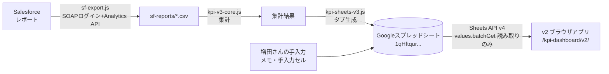

# 1係 KPIダッシュボード v2 ─ 設計書

[SPEC.md](SPEC.md) の要件を、どう実装するかに落としたもの。2026-09-09 作成。

---

## 1. 全体構成



- 日次バッチ（`run-daily.js`）が平日に走り、スプシを更新する。**v2は生成側に一切触れない読み手**。
- v2は再計算しない。スプシに書かれた確定値をそのまま表示する（数字の二重定義を作らないため）。

## 2. ホスティングとURL

| 項目 | 値 |
|---|---|
| リポジトリ | `masuda15k/kpi-dashboard`（既存・branch `main`） |
| 追加するパス | `v2/index.html` |
| 公開URL | `https://masuda15k.github.io/kpi-dashboard/v2/` |
| 現行v1 | `https://masuda15k.github.io/kpi-dashboard/`（**そのまま残す**） |

同一オリジンなのでOAuthクライアントの承認済みオリジン設定は**変更不要**。

## 3. 認証設計

- Google Identity Services のトークンクライアント（v1と同方式）。クライアントIDはv1と同じものを使う。
- `use_fedcm_for_prompt: true` を維持（サードパーティCookieがブロックされていても自動更新が通るようにするため。v1でこの対策済み）。
- 再訪問時は `localStorage` の「前回サインイン済み」フラグを見て、`prompt: ''` で静かに再認証。
- トークン期限の5分前に裏側で更新。画面は再描画しない。
- **スコープ**: v2は表示専用なので最小権限にする。
  - 第一候補: `spreadsheets.readonly` + `userinfo.email`
  - リスク: OAuth同意画面に未登録のスコープはエラーになる可能性がある。実装時に検証し、通らなければv1と同じ `spreadsheets` にフォールバックする（**未確認**）。
- 識学アカウント以外は、スプシの共有権限が無いためAPIが403を返す。アプリ側で追加の制限は掛けない。

## 4. データ取得設計

```
表示対象が「1係全体」 → 報告 / 分析 / メモ
表示対象がメンバー     → 該当メンバータブ / 分析 / メモ
```

- `values.batchGet` で必要タブを1リクエストにまとめる。
- 取得済みタブはメモリにキャッシュし、表示対象を切り替えても再取得しない（分析・メモは共通なので2回目以降は0リクエスト）。
- 失敗時はカードを空にせず、画面上部にエラー文を出す。

## 5. シート契約（v2が依存する書式）

**これが崩れるとv2が壊れる。生成側を変えるときはここも合わせて直す。**

セクションは必ず**見出し文字列で探す**。行番号は決め打ちしない（v1で行番号決め打ちにより手入力データを破壊した事故があったため）。

### 5.1 報告タブ / メンバータブ

| 見出し | 構造 |
|---|---|
| `■KPI 評価項目サマリー（結果/目標/不足/達成率）` | 指標ごとに見出し行 `[指標名, 結果, 目標, 不足, 達成率, 転換率テキスト]`（**6列目に転換率**）→ 続く行が `3Q` `今週` `9月` `10月` `11月` `対営業日進捗`。指標は 新規獲得件数 → P2コンサル部提案提供数 → 商談実施数 の順で出力される（**画面では逆順に並べる**） |
| `■FUNNEL 歩留まりファネル（Q累計・全体）`（メンバータブは`・本人分`） | 1行目=段階名10列、2行目=件数10列、3行目=空、4行目=在庫の見出し4列、5行目=在庫の件数4列 |

### 5.2 分析タブ

| 見出し | 用途 |
|---|---|
| `■1. セグメント別転換率マトリクス` | `— 見出し —` で区切られた小表が4つ（商談カテゴリー／KPI区分／起点・受領／役職セグメント）。各ブロックは 区切り行 → ヘッダー行 → データ行 |
| `■3. 活動相関（週次：架電→アポ）` | 週次トレンド（1係全体用）。列は 週／架電数／アポ獲得／転換率 |
| `■4. 滞留案件一覧（P3以降30日超）` | 列は 取引先／担当／フェーズ／滞留日数 |
| `■5. データ品質チェック` | 列は 種別／取引先／担当／予定日／超過営業日／確認すること。0件のとき `（該当なし）` が入る |
| `■6. 商談分析` | 列は 担当／会社名／日付／ランク／合計(/37)／各項目。直近の活動カードのソース |

### 5.3 ⚠ 番号の衝突に注意

**分析タブとメンバータブで、同じ `■n.` が別物を指す。**

| 番号 | 分析タブ | メンバータブ |
|---|---|---|
| ■1 | セグメント別転換率マトリクス | 目標対比 |
| ■2 | 失注理由の内訳 | ファネルと転換率（本人vs係平均） |
| ■3 | 活動相関（週次：架電→アポ） | パスした案件のその後 |
| ■4 | 滞留案件一覧 | 週次トレンド（商談実施／P2） |
| ■5 | データ品質チェック | 先行在庫と必要自アポ |
| ■6 | 商談分析（採点表） | 行動分析・商談分析（本人分） |

→ v2はセクションを探すとき、**どのタブから取ったparsed結果に対して探しているかを引数で明示的に分ける**。`■3.` で横断検索してはいけない。

### 5.4 週次トレンドのデータ源（スコープで変わる）

| 表示対象 | ソース | 出す系列 |
|---|---|---|
| 1係全体 | 分析タブ `■3. 活動相関` | 架電数・アポ獲得 |
| メンバー | 該当メンバータブ `■4. 週次トレンド` | 商談実施・P2 |

### 5.5 メモタブ

- 生成側は `writeSheet` を呼ばない。`resetFormats` の対象からも除外済み（手で付けた書式が消えない）。
- v2は解釈せず、グリッドをそのまま表として出す。

## 6. 画面レイアウト設計

### 6.1 シェル

```
┌────────────┬───────────────────────────────────────────────┐
│            │ メインバー（見出し・表示対象・データ更新時刻）  │
│ サイドバー  ├───────────────────────────────────────────────┤
│ 208px      │                                               │
│            │  カードグリッド（12列 × 3行）                   │
│ ・ロゴ      │                                               │
│ ・時刻      │                                               │
│ ・表示対象  │                                               │
│ ・営業日進捗│                                               │
│ ・ユーザー  │                                               │
└────────────┴───────────────────────────────────────────────┘
        高さ = 100vh 固定。html/body は overflow:hidden
```

### 6.2 グリッド配置

`grid-template-columns: repeat(12, 1fr)` / `grid-template-rows: 1fr 1.15fr 0.9fr`

| 行 | カード（左→右） | 列幅 |
|---|---|---|
| 1 | ネクストアクション / 商談実施数 / P2コンサル部提案提供数 / 新規獲得件数 | 3 / 3 / 3 / 3 |
| 2 | 歩留まりファネル / 対応が必要な案件 / 直近の活動 | 6 / 3 / 3 |
| 3 | 週次トレンド / メモ / （v2では予備枠） | 4 / 4 / 4 |

- 全カードに `min-height:0; max-height:100%; overflow-y:auto` を掛け、**はみ出しはカード内で吸収**する。
- 1100px以下では段組みを崩し、パネル内スクロールに切り替える（1画面厳守は広い画面だけの要件とする）。
- v1で `grid-row: span 2` が行高を過剰に確保する不具合を踏んだため、**行スパンは使わない**。

### 6.3 デザイントークン（リブランディング準拠）

`Shikigaku_template_v2.pptx` のテーマカラーをそのまま使う。

| 用途 | 値 | テーマ上の位置 |
|---|---|---|
| カード地 / ブランド紺 | `#101D32` | dk2 |
| 画面地 | `#080f1c` | dk2をさらに沈めた値 |
| 文字 | `#E6EAE3` | lt2 |
| アクセント（主） | `#64C0AB` | accent6 |
| アクセント（副・数値強調） | `#7ECEF4` | hlink |
| 良好 | `#649A5B` | accent1 |
| 注意 | `#FFC800` | accent4 |
| 危険 | `#E60020` | accent3 |
| 書体 | 游ゴシック（`"Yu Gothic", "游ゴシック"`） | テーマ書体 |

- 参考画面（SIGNAL DECK）の多色ネオンは**採用しない**。アクセントは青緑1色＋明青を数値強調に限定し、緑黄赤は状態表示専用にする（SPEC受入基準5「用語と意味の一貫性」に反するため）。
- 角丸10px、境界線は明青を14%に落とした線。カード見出しの左に小さな発光ドットを置き、参考画面の"計器盤"の質感だけ借りる。

## 7. カード描画仕様

| カード | 実装の要点 |
|---|---|
| ネクストアクション | ①在庫滞留（P2提案待ち ≥ しきい値かつ新規0件）②対営業日進捗 < 100% の2ルールで判定。根拠に使った数字を `why` として併記。0件なら「順調」表示に切り替え、枠色を緑に |
| 評価項目3枚 | `■KPI` の指標ブロックを読み、**商談実施→P2→新規の順に並べ替えて**描画。月次3行は `display:none` で保持し、トグルで開閉。達成率はバッジ（緑/黄/赤） |
| 歩留まりファネル | 棒の高さは**平方根スケール**（アプローチ443 と 成約0 のように桁が違うため、線形だと後段が見えない）。段階間に率、100%超はそのまま表示。切替は全体/役職セグメント/起因・受領 |
| 対応が必要な案件 | 分析`■4`+`■5` を結合。SFリンクは会社名検索 `https://shikigaku.lightning.force.com/lightning/search/{会社名}`（**商談IDがCSVに無いため直リンク不可。将来ID列を追加できれば `/lightning/r/Opportunity/{ID}/view` に変更**） |
| 直近の活動 | 分析`■6` を日付降順。会社名・担当・ランクを出す |
| 週次トレンド | インラインSVGの折れ線。スコープでソースを切り替える（5.4参照） |
| メモ | メモタブのグリッドをそのまま表に。空なら「スプシのメモタブに書くとここに出ます」と案内 |

## 8. 状態とエラー

| 状態 | 挙動 |
|---|---|
| 未ログイン | 全画面オーバーレイでログインゲート。**背後のカードを透けさせない**（v1で日報タブが透けて見える不具合を踏んだ） |
| 読み込み中 | 画面上部にピル状のトースト |
| API失敗 | トーストを赤に切り替えて理由を出す。カードは前回表示を残す |
| セクションが見つからない | そのカードだけ「データが見つかりません（見出し名）」と出す。他のカードは描画を続行する |
| 0件 | 必ず文章で状態を示す（空白禁止・受入基準6） |

## 9. ファイル構成

```
kpi-dashboard-webapp/
├── index.html          … v1（触らない）
├── GOALS.md            … ゴール定義（v2もこれに従う）
└── v2/
    ├── SPEC.md         … 仕様書
    ├── DESIGN.md       … 本書
    └── index.html      … v2本体（単一ファイル・ビルド不要）
```

単一HTMLを維持する理由: GitHub Pagesにそのまま置ける／ビルド工程が無く壊れる箇所が少ない／v1で実証済み。

## 10. v1から意図的に引き継がないもの

| 引き継がないもの | 理由 |
|---|---|
| スクロール連動の出現アニメ（reveal） | スクロールしない画面では発火せず、カードが出ないままになる |
| 背景の光の膨らみ（bg-glow） | 計器盤の密度と競合する |
| 明朝の見出し書体 | リブランディングは游ゴシック |
| 3階層ナビ（表示対象＋タブ＋セグメント） | サイドバー1箇所に集約する |
| 日報・週報・月報のフォーム | v1スコープ外。入力はスプシ側 |
| 過去実績タブ | v1スコープ外 |
| 江波戸さんの表示対象 | 2026-09-01離脱済み |

## 11. 実装順序

1. シェル（サイドバー＋メインバー＋空のグリッド）＋認証＋データ取得までを通す
2. 評価項目3枚（数字がスプシと一致することを確認）
3. 歩留まりファネル（平方根スケールと率の検証）
4. 対応が必要な案件／直近の活動（0件時の表示を先に作る）
5. ネクストアクション（上の数字が出揃ってから判定ルールを載せる）
6. 週次トレンド／メモ
7. 高さ実測 → 受入基準1（スクロール0）の確認 → 公開

各段階でブラウザ上の実データで高さと数値を実測してから次に進む（v1では見積りで進めて何度も戻った）。

## 12. 未確認・実装時に判断すること

- `spreadsheets.readonly` スコープが同意画面設定で通るか（通らなければ `spreadsheets` にフォールバック）
- ネクストアクションのしきい値（在庫何件から警告とするか）
- 週次トレンドの系列を架電/アポで確定してよいか
- 3行目の予備枠に何を置くか（増田さんから追って指定される想定）
- v1と入れ替える時期
